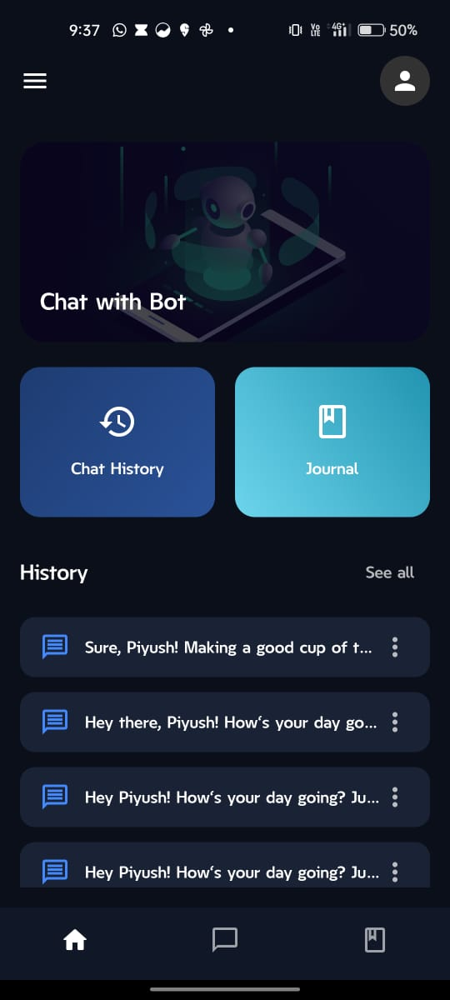
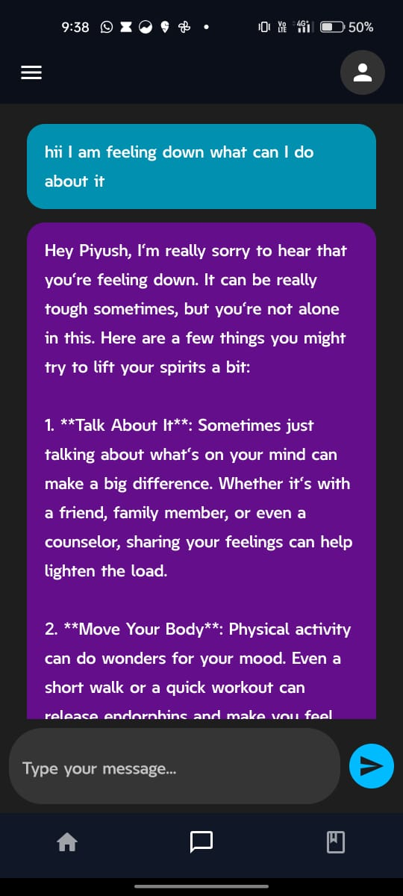
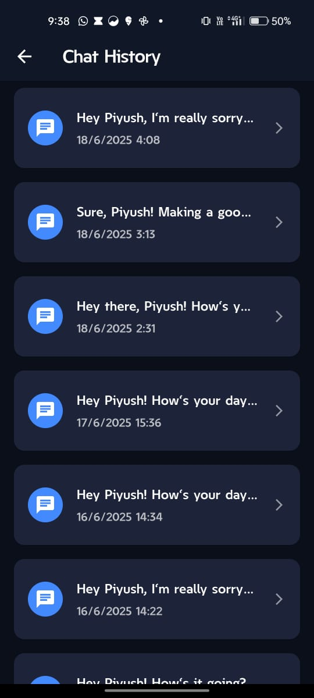
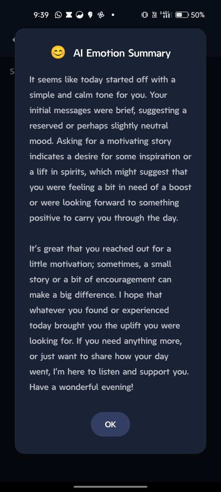
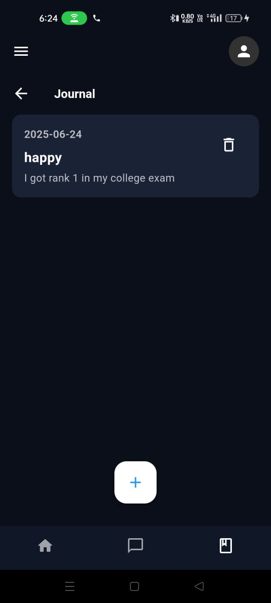

# 🤖 PsycheSense AI

A cross-platform AI-powered emotion diagnosis application built using **Flutter** for the frontend and **FastAPI** for the backend. The app allows users to chat with an intelligent bot for comforting responses, emotion analysis and more — all with secure authentication and real-time performance.

---

## 🧠 Features

### 🔐 Authentication
- Secure JWT-based login & signup
- User profile management
- Password hashing and validation

### 💬 AI Chat
- Real-time chat with AI for health symptom diagnosis
- Responses based on user queries, powered by NLP & AI logic

### 🖼️ Emotion Analysis
- Emotion summary for the entire day based on user chats
- AI summarizes the chats and extracts useful emotional insights

### Journal
- User can write daily journals about their emotions

### 🕰️ Chat History
- Save and view previous chats with AI
- Organized conversation history per user

---

## 🧰 Tech Stack

### Frontend (Flutter)
- Flutter SDK
- Provider (State Management)
- Dio (API handling)
- SharedPreferences (Local storage)
- MVVM Architecture

### Backend (FastAPI)
- FastAPI for building REST APIs
- NeonDB for cloud-based SQL data storage
- MongoDB Atlas for cloud-based NoSQL data storage
- JWT for authentication
- Pydantic for data validation
- CORS & Middleware for secure and scalable API access

---

## 📸 Application Screenshots

| Home Page | AI Chat Page | Chat History | Emotion Summary | Journal Page |
|:--:|:--:|:--:|:--:|:--:|
|  |  |  |  |  |

---

## 📦 APK Download

Download the latest APK from the link below:

📥 [Download APK from Google Drive](https://drive.google.com/file/d/1HUjq8Kv3O53wZ__Hr5H8adhnAtJBcuWI/view?usp=drive_link)

---
